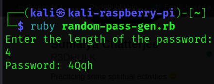

<h1><b>Random Password Generator</b></h1>
<h2><i>A random password generator is software program or hardware device that takes input from a random or pseudo-random number generator and automatically generates a password. Random passwords can be generated manually, using simple sources of randomness such as dice or coins, or they can be generated using a computer.</h1></i>

#
 </a>

#
<h2><b> 😇 Author: Sumalya Chatterjee </b></h2>

#
<h1><b>❤️ Don't Copy, Do Fork 😊</b></h1>

#

<h1><b>Result 👇</b></h1>



#

<h1><b>Git Installation </h1></b>

```
# Install Git
sudo apt install git

# Install Ruby
sudo apt install ruby

# Git Clone
git clone https://github.com/R3DHULK/random-password-generator-in-ruby

# Change Directory
cd random-password-generator-in-ruby

# For Encoding Message
ruby random-pass-gen.rb

```

#
<h2><b><i> Show Support 👇👇👇</b></i> </h2>
<a href="https://www.buymeacoffee.com/r3dhulk"> </a><br><br>
